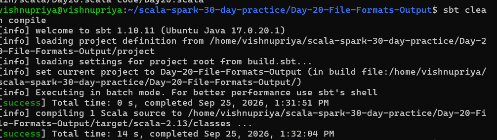
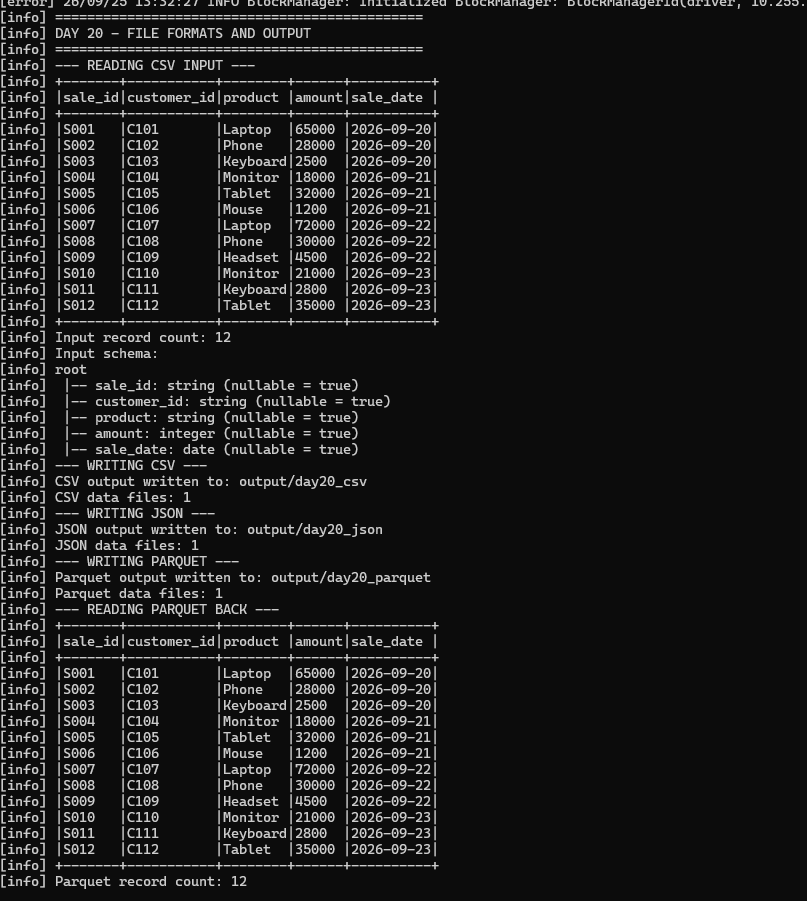
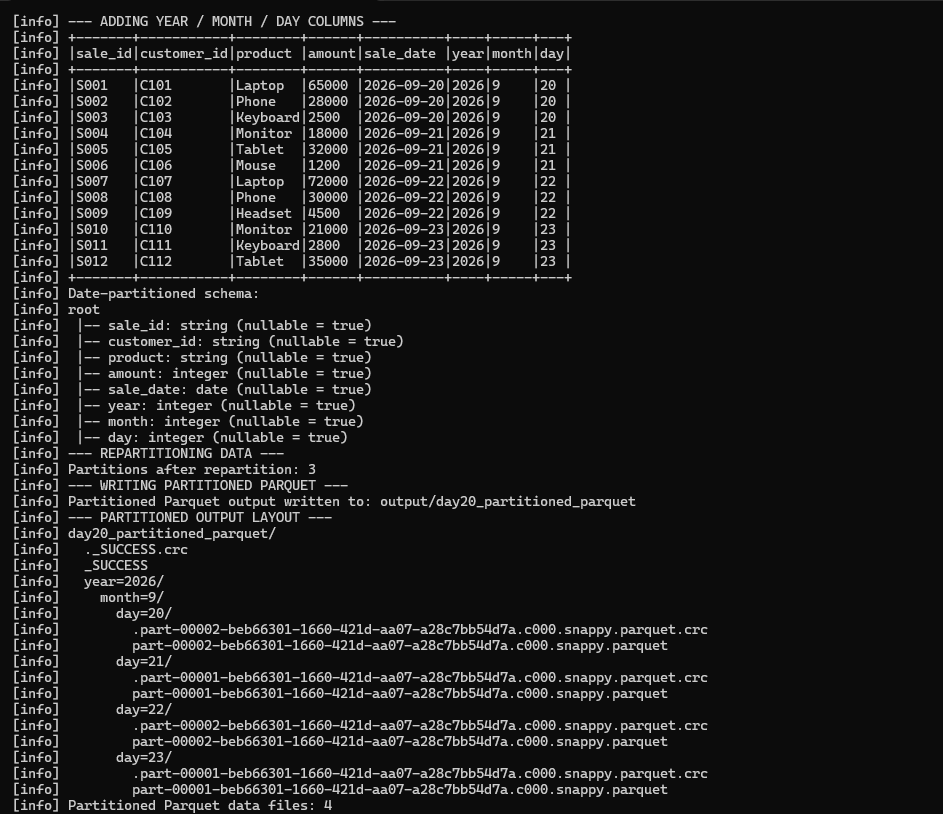
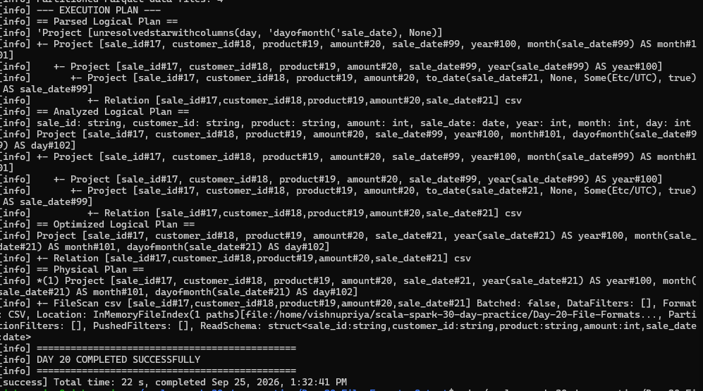

# Day 20 - File Formats and Output

## Objective

Practice reading and writing CSV, JSON, and Parquet files using Apache Spark, create partitioned output, inspect the output file layout, and use repartitioning before writing.

## Practice Requirements

- Read CSV input
- Write CSV output
- Write JSON output
- Write Parquet output
- Read Parquet output back
- Create year, month, and day columns
- Repartition data before writing
- Write partitioned Parquet output
- Inspect the partitioned directory layout
- Explain the execution plan and output-file behavior

## Technologies

- Scala 2.13.18
- Apache Spark 4.2.0
- SBT 1.10.11
- Java 17
- Ubuntu / WSL2

## Input Dataset

The sample dataset contains 12 daily sales records.

Input file:

    input/daily_sales.csv

Columns:

- sale_id
- customer_id
- product
- amount
- sale_date

## Implementation

The program:

1. Creates a local Spark session using local[4].
2. Reads the CSV input.
3. Writes the data as CSV.
4. Writes the data as JSON.
5. Writes the data as Parquet.
6. Reads the Parquet output back.
7. Creates year, month, and day columns from sale_date.
8. Repartitions the data into 3 partitions using the date columns.
9. Writes partitioned Parquet output.
10. Prints the partitioned directory layout.
11. Counts actual Parquet data files recursively.
12. Displays the Spark execution plan.

## Output Locations

    output/day20_csv/
    output/day20_json/
    output/day20_parquet/
    output/day20_partitioned_parquet/

## Partitioned Output

The final Parquet data is partitioned by:

    .partitionBy("year", "month", "day")

Generated structure:

    year=2026/
    └── month=9/
        ├── day=20/
        ├── day=21/
        ├── day=22/
        └── day=23/

The program repartitioned the DataFrame into 3 Spark partitions before writing.

The final output contains 4 actual Parquet data files across the four date partitions.

## Output File Counts

| Format | Data files |
|---|---:|
| CSV | 1 |
| JSON | 1 |
| Parquet | 1 |
| Partitioned Parquet | 4 |

_SUCCESS and .crc files are Spark/Hadoop metadata or checksum files and are not counted as data files.

## Repartitioning

The program uses:

    datedSalesDF.repartition(
      3,
      col("year"),
      col("month"),
      col("day")
    )

This demonstrates repartitioning data before writing.

Repartitioning involves a shuffle because Spark redistributes records according to the specified partitioning expressions.

## Execution Plan

The program uses:

    datedSalesDF.explain(true)

This displays:

- Parsed Logical Plan
- Analyzed Logical Plan
- Optimized Logical Plan
- Physical Plan

## Screenshots

### Compilation

### File Format Outputs

### Partitioned Output Layout

### Execution Plan

## Result

Day 20 was completed successfully.

The application processed 12 sales records and successfully generated CSV, JSON, Parquet, and date-partitioned Parquet outputs.
