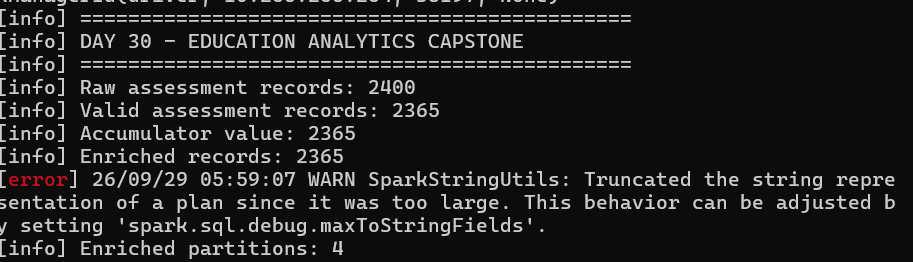
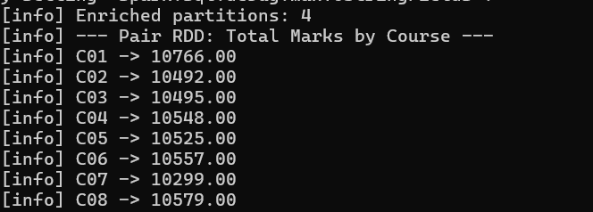
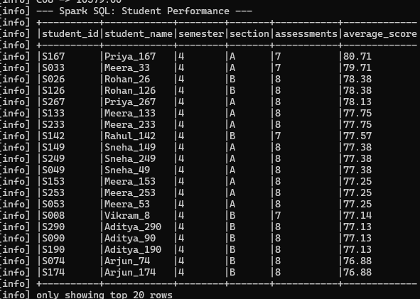
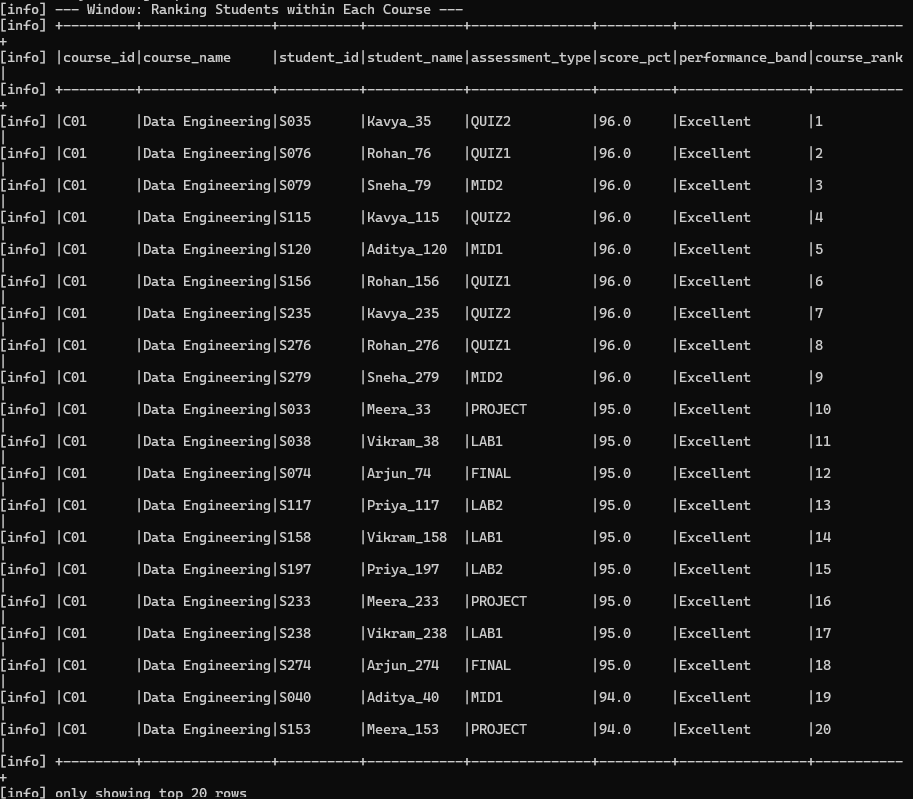
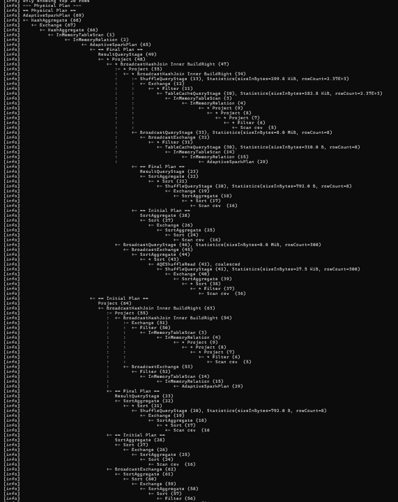
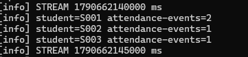

# Day 30 — Education Analytics Capstone

## 1. Project Overview
Education Analytics platform built with Scala and Apache Spark. It combines batch student-assessment analytics with real-time attendance-event processing.

**Stack:** Scala 2.13.18, Apache Spark 4.2.0, Java 17, sbt 1.10.11, local[4].

## 2. Objectives
- Clean and validate assessment records.
- Calculate score percentages and classify performance with a UDF.
- Enrich assessments with course and student reference data.
- Demonstrate Pair RDD aggregation, Spark SQL and window functions.
- Demonstrate broadcast, accumulator, cache/persist and partition tuning.
- Inspect DAG, lineage, shuffle boundaries and the physical plan.
- Process attendance events with Spark Streaming.
- Explain Driver, Executors, stages and YARN.
- Prepare 20 interview questions.

## 3. Pipeline Architecture

### 3.1 End-to-End Architecture
~~~text
                    EDUCATION ANALYTICS PLATFORM
                               |
              +----------------+----------------+
              |                                 |
          BATCH PIPELINE                  STREAMING PIPELINE
              |                                 |
    +---------+---------+                    TCP :9998
    |         |         |                       |
Assessments Courses Students                    |
    |         |         |                       v
    +---------+---------+                  Spark DStream
              |                                 |
              v                                 v
       Data Validation                    Parse Events
              |                                 |
              v                                 v
       Score Percentage                  (student_id, 1)
              |                                 |
              v                                 v
       Performance UDF                  updateStateByKey
              |                                 |
              v                                 v
         Cache / Persist                  Running Counts
              |
              v
   Repartition by student_id
              |
       +------+------+
       |             |
       v             v
 Broadcast       Student
 Course Join       Join
       |             |
       +------+------+
              |
              v
       Enriched Dataset
              |
    +---------+----------+-------------+
    |         |          |             |
    v         v          v             v
 Pair RDD  Spark SQL  Window       Physical Plan
Aggregate             Ranking       Analysis
~~~

### 3.2 Batch Flow
~~~text
CSV Files -> DataFrames -> Validation -> Score % -> UDF
          -> Cache -> Repartition -> Broadcast/Joins
          -> Enriched Dataset -> RDD / SQL / Window / Plan
~~~

### 3.3 Streaming Flow
~~~text
attendance-events.txt -> TCP :9998 -> Spark DStream
-> Parse/Filter -> (student_id, 1) -> updateStateByKey
-> Running Attendance Counts
~~~

## 4. Input Data

| File | Purpose |
|---|---|
| assessments.csv | Student assessment records |
| courses.csv | Course reference data |
| student-profiles.csv | Student master/reference data |
| attendance-events.txt | Streaming attendance events |

The expanded assessment dataset contains **300 students, 8 courses and 2,400 raw assessment records**. After validation, **2,365 records** remain valid.

## 5. Batch Processing

1. Read assessment, course and student CSV files.
2. Convert dates and numeric columns to the required types.
3. Normalize text fields.
4. Remove missing identifiers and invalid dates.
5. Validate mark ranges and status.
6. Calculate score percentage.
7. Apply the performance-band UDF.
8. Cache cleaned assessments.
9. Repartition by student ID.
10. Broadcast the small course reference data.
11. Join student reference data.
12. Run Pair RDD aggregation.
13. Run Spark SQL aggregation.
14. Run window ranking.
15. Inspect the physical plan.

## 6. Data Validation and UDF

Score calculation:

~~~text
score_pct = marks / max_marks * 100
~~~

Performance classification:

| Score | Band |
|---:|---|
| >= 85 | Excellent |
| >= 70 | Good |
| >= 50 | Average |
| < 50 | Needs Improvement |

## 7. Runtime Results

| Metric | Result |
|---|---:|
| Raw assessment records | 2,400 |
| Valid assessment records | 2,365 |
| Accumulator value | 2,365 |
| Enriched records | 2,365 |
| Enriched partitions | 4 |

The verified batch run completed successfully with:

~~~text
[success] Total time: 36 s
~~~

## 8. Pair RDD Aggregation

The cleaned assessment data is converted into pairs of:

~~~text
(course_id, marks)
~~~

The workflow uses reduceByKey and sortByKey.

| Course | Total Marks |
|---|---:|
| C01 | 10,766.00 |
| C02 | 10,492.00 |
| C03 | 10,495.00 |
| C04 | 10,548.00 |
| C05 | 10,525.00 |
| C06 | 10,557.00 |
| C07 | 10,299.00 |
| C08 | 10,579.00 |

The key-based aggregation introduces a shuffle dependency.

## 9. Spark SQL

The enriched dataset is registered as the education_assessments temporary view.

The SQL analysis calculates:

- Student ID and name.
- Semester and section.
- Assessment count.
- Average score percentage.
- Descending performance order.

Example verified result:

~~~text
S167  Priya_167  80.71
S033  Meera_33   79.71
~~~

## 10. Window Function

Students are ranked **within each course** using:

~~~text
PARTITION BY course_id
ORDER BY score_pct DESC, student_id ASC
~~~

The implementation uses row_number() and outputs course, student, score, performance band and rank.

## 11. Broadcast Join

The small course reference dataset is broadcast before joining.

~~~text
BroadcastExchange
       |
BroadcastQueryStage
       |
BroadcastHashJoin
~~~

Broadcasting allows the small reference data to be distributed to executors and avoids a normal shuffle of that reference side.

The executed physical plan also shows a broadcast-based student reference join.

## 12. Cache and Persist

The cleaned assessment DataFrame uses cache().

The enriched dataset uses:

~~~text
StorageLevel.MEMORY_AND_DISK
~~~

The physical plan shows InMemoryRelation and InMemoryTableScan, confirming persisted data is being reused.

## 13. Accumulator

A LongAccumulator named valid-assessment-records counts valid assessment records.

Verified value:

~~~text
2,365
~~~

The streaming component also uses an accumulator for observed attendance-event state.

## 14. Partition Tuning

The enriched data is explicitly repartitioned using:

~~~text
repartition(4, student_id)
~~~

Verified result:

~~~text
Enriched partitions: 4
~~~

The physical plan contains hashpartitioning(student_id, 4) and REPARTITION_BY_NUM.

## 15. Shuffle and Physical Plan

The formatted physical plan contains operators including:

- AdaptiveSparkPlan
- HashAggregate
- Exchange
- BroadcastExchange
- BroadcastHashJoin
- ShuffleQueryStage
- InMemoryRelation
- InMemoryTableScan

A reduceByKey aggregation and explicit repartition can create shuffle boundaries.

AdaptiveSparkPlan confirms that adaptive query execution participates in the SQL execution.

## 16. Spark Execution Model

### Driver
Creates the Spark session, builds execution plans, coordinates jobs/stages and collects results.

### Executors
Run tasks against partitions and perform transformations, joins and aggregations.

### DAG
Spark builds a Directed Acyclic Graph from transformations and actions.

~~~text
Read -> Filter -> Transform -> Repartition -> Join -> Aggregate -> Action
~~~

### Lineage
Lineage records how a dataset was derived from earlier datasets and supports fault recovery.

### Stages
Shuffle boundaries separate stages. Narrow transformations can remain within a stage, while wide operations such as key-based aggregation can introduce stage boundaries.

## 17. YARN

This project runs locally with local[4], so YARN is not required for execution.

In a Hadoop deployment, YARN can manage cluster resources:

~~~text
Spark Application
       |
YARN Resource Manager
       |
       +-------------+
       |             |
Node Manager    Node Manager
       |             |
   Executor       Executor
~~~

## 18. Streaming Processing

The streaming component uses a TCP receiver on localhost:9998 with a 5-second batch interval.

Each valid event becomes:

~~~text
(student_id, 1)
~~~

State is maintained with updateStateByKey.

Verified output included:

~~~text
student=S001 attendance-events=2
student=S002 attendance-events=1
student=S003 attendance-events=1
~~~

### Streaming Test

Terminal 1:

~~~bash
nc -l 9998 < input/attendance-events.txt
~~~

Terminal 2:

~~~bash
sbt "run streaming"
~~~

## 19. Project Structure

~~~text
Day-30-Final-Educational-Capstone/
├── input/
│   ├── assessments.csv
│   ├── courses.csv
│   ├── student-profiles.csv
│   └── attendance-events.txt
├── screenshots/
│   ├── 01-batch-data-processing-summary.png
│   ├── 02-pair-rdd-course-aggregation.png
│   ├── 03-spark-sql-student-performance.png
│   ├── 04-window-function-course-ranking.png
│   ├── 05-physical-plan-spark-optimization.png
│   └── 06-streaming-attendance-results.png
├── src/main/scala/Day30.scala
├── INTERVIEW-QUESTIONS.md
├── README.md
├── build.sbt
└── .jvmopts
~~~

## 20. Execution Commands

### Compile
~~~bash
sbt clean compile
~~~

### Batch
~~~bash
sbt "run batch"
~~~

### Streaming
~~~bash
nc -l 9998 < input/attendance-events.txt
sbt "run streaming"
~~~

### Both Modes
~~~bash
sbt "run all"
~~~

## 21. Evidence and Screenshots

### Batch Data Processing

### Pair RDD Course Aggregation

### Spark SQL Student Performance

### Window Function Course Ranking

### Physical Plan and Spark Optimization

### Streaming Attendance Results

## 22. Requirements Coverage

| Requirement | Implementation |
|---|---|
| Education domain | Education Analytics |
| Batch | Assessment analytics |
| Streaming | Attendance DStream |
| Broadcast | Reference-data joins |
| Accumulator | Valid-record counter |
| Cache/Persist | cache and MEMORY_AND_DISK |
| Partition tuning | 4 partitions by student_id |
| Spark SQL | Student performance aggregation |
| Joins | Course and student joins |
| Aggregation | Pair RDD and SQL |
| Window | Course-level row_number |
| UDF | Performance-band UDF |
| Shuffle | Repartition and key aggregation |
| Physical plan | explain("formatted") |
| DAG / lineage | Documented |
| Executors / YARN | Documented |
| Interview preparation | 20 questions |
| Evidence | 6 screenshots |

## 23. Interview Preparation

The repository includes **20 interview questions with answers** in [INTERVIEW-QUESTIONS.md](INTERVIEW-QUESTIONS.md).

Topics include Spark architecture, Driver and Executors, transformations/actions, lazy evaluation, narrow/wide transformations, shuffle, partitions, broadcast joins, accumulators, cache/persist, Spark SQL, windows, UDFs, DAG/stages, streaming, state management, adaptive execution, fault tolerance and YARN.

## 24. Troubleshooting

### Connection Refused
Start the TCP listener before the streaming application:

~~~bash
nc -l 9998 < input/attendance-events.txt
~~~

### Compilation Warning
A Spark deprecation warning may appear. It is not a compilation failure when sbt ends with a success message.

### Large Physical Plan Warning
Spark may truncate the displayed physical-plan string when the plan is large. This does not indicate that the Spark job failed.

## 25. Performance and Optimization Summary

| Technique | Purpose |
|---|---|
| Validation | Remove invalid records |
| Cache | Reuse cleaned data |
| MEMORY_AND_DISK | Persist enriched data |
| Broadcast | Efficient small-reference joins |
| Repartition | Control partition distribution |
| reduceByKey | Key aggregation |
| Spark SQL | Declarative analytics |
| Window | Per-course ranking |
| Adaptive execution | Runtime query optimization |
| Physical-plan inspection | Understand exchanges and joins |

## 26. Conclusion

This capstone demonstrates a complete education analytics workflow from raw assessment data through validation, transformation, UDF classification, partitioning, joins, aggregation, SQL, window analysis and physical-plan inspection.

It also demonstrates real-time attendance processing through Spark Streaming and stateful updateStateByKey processing.

The implementation, runtime output and six screenshots provide evidence for the required Day 30 concepts.
